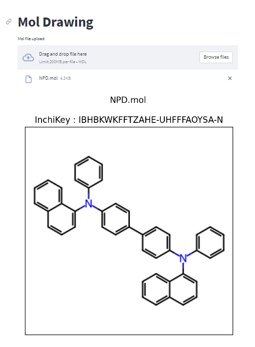

# mol-draw

molファイルをアップロードすると分子構造を描画する

https://s-yagyu-mol-draw-mol-upload-draw-cloud-x5cmef.streamlit.app/

example mol files

https://github.com/s-yagyu/mol-draw/tree/main/mol_sample

### 利用しているモジュール

rdkitモジュールを利用しています。

### 苦労したところ（1）

アップロードしたファイルがStremalitで用意している普通のファイルではなく、mol形式のファイル。

rdkit側では、ファイルのパスを指定しないと読み込むことができない。

mpfile.NamedTemporaryFileを利用。

[streamlist-file-uploader-example](https://github.com/hurutoriya/streamlist-file-uploader-example/blob/main/streamlit_pdf_uploader/main.py)

### 苦労したこと（2）

Stremlit Cloudにデプロイでモジュールの指定で問題。

- Condaのenvironment.ymlで最初トライ
  -> うまくいかなかった
- requirements.txtに変更
　-> from rdkit.Chem import Drawのインポートエラー
- packages.txtの追加
  -> うまくいった

こちらの記事が参考になりました。感謝！

[hemoinfo のアプリをStreamlitを使ってDeployする #streamlit #RDKit #souyakuAC2020](https://iwatobipen.wordpress.com/2020/12/20/chemoinfo-%E3%81%AE%E3%82%A2%E3%83%97%E3%83%AA%E3%82%92streamlit%E3%82%92%E4%BD%BF%E3%81%A3%E3%81%A6deploy%E3%81%99%E3%82%8B-streamlit-rdkit-souyakuac2020/)

[chem_streamlit　Github](https://github.com/iwatobipen/chem_streamlit)

